# Azure Migrate Simulations

> Discover VMware vCenter workloads and simulate Azure migration scenarios — assess, plan, and optimise your move to Azure from a single dashboard.

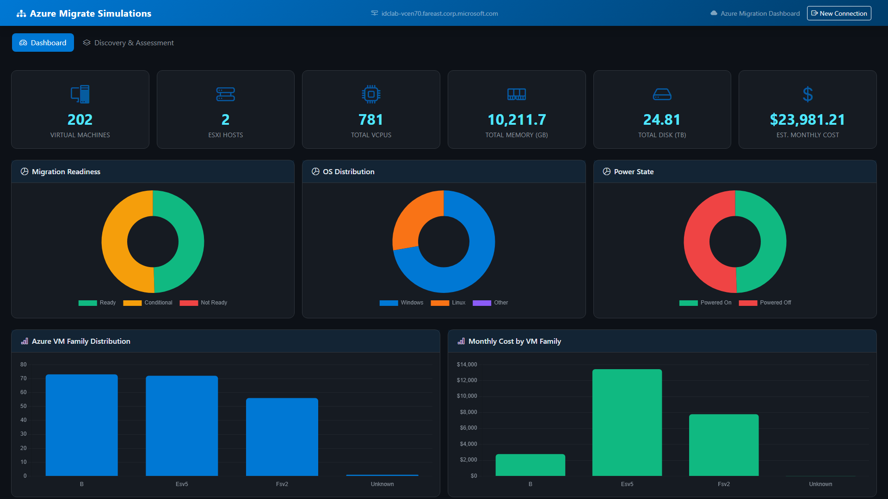

---

## Table of Contents

- [Features at a Glance](#features-at-a-glance)
- [Screenshots & Walkthrough](#screenshots--walkthrough)
  - [Connect Screen](#1-connect-screen)
  - [Dashboard](#2-dashboard)
  - [Discovery & Assessment](#3-discovery--assessment)
  - [Inventory](#4-inventory)
  - [Topology Views](#5-topology-views)
  - [VM Assessment](#6-vm-assessment)
  - [Workload Assessment](#7-workload-assessment)
  - [VM What-If Analysis](#8-vm-what-if-analysis)
  - [Workload What-If Analysis](#9-workload-what-if-analysis)
  - [VM Simulation](#10-vm-simulation)
  - [Workload Simulation](#11-workload-simulation)
- [Architecture](#architecture)
- [Tech Stack](#tech-stack)
- [Quick Start](#quick-start)
- [CLI Usage](#cli-usage)
- [API Reference](#api-reference)
- [Project Structure](#project-structure)

---

## Features at a Glance

| Category | Highlights |
|---|---|
| **vCenter Discovery** | Auto-discover datacenters, clusters, ESXi hosts, VMs, datastores, networks via pyVmomi |
| **Guest-Level Discovery** | SSH (Linux) and WinRM (Windows) probes detect databases, web apps, containers, orchestrators |
| **Infrastructure Topology** | Interactive vis-network graphs showing vCenter hierarchy and cross-VM dependency maps |
| **Azure SKU Recommendations** | Right-size VMs to 20+ Azure SKUs across B/D/E/F families with readiness and confidence scoring |
| **Workload PaaS Mapping** | Map 7 DB engines, 8 web runtimes, 4 container runtimes to Azure PaaS services with migration playbooks |
| **What-If Analysis** | Per-VM and per-workload scenario modelling — change SKU, region, pricing, and see cost deltas instantly |
| **Migration Simulation** | Fleet-wide cost projection, 12-month charts, migration wave planning with drag-and-drop re-assignment |
| **Performance Monitoring** | Background collector captures CPU, memory, IOPS, network I/O every 15 minutes with sparkline charts |
| **43 REST API Endpoints** | Programmatic access to every capability — connection, discovery, assessment, simulation, perf data |

---

## Screenshots & Walkthrough

### 1. Connect Screen

The landing page lets you connect to a live VMware vCenter (URL + credentials) or upload a previously exported discovery report JSON file.

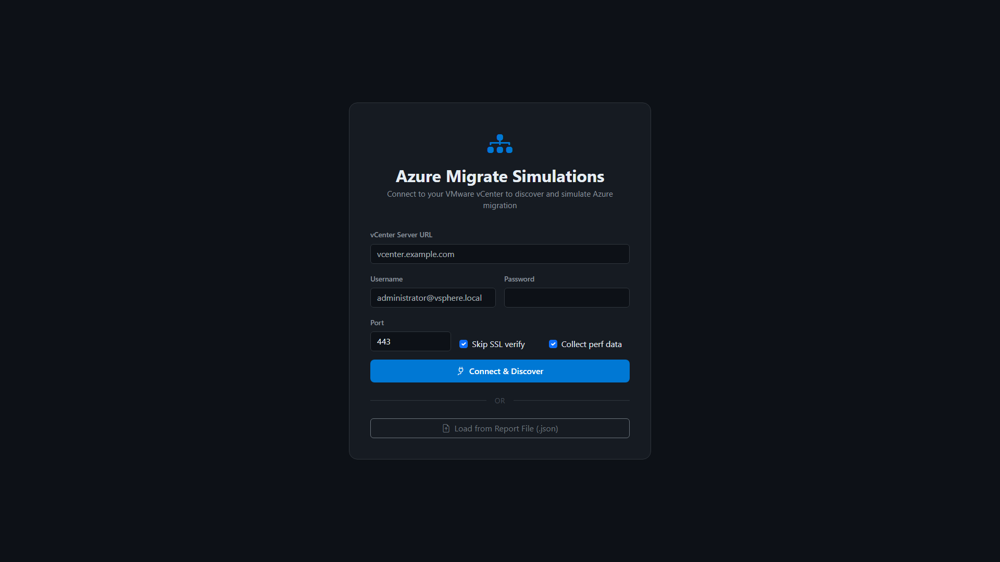

---

### 2. Dashboard

After connecting, the dashboard presents a fleet-wide overview:

- **6 summary cards** — VM count, ESXi hosts, total vCPUs, memory (GB), disk (TB), estimated monthly Azure cost
- **6 interactive charts** — Migration Readiness (doughnut), OS Distribution (doughnut), Power State (doughnut), Azure VM Family Distribution (bar), Monthly Cost by Family (bar), VMs by Folder (bar)


<details>
<summary><strong>Full Dashboard (all charts)</strong></summary>

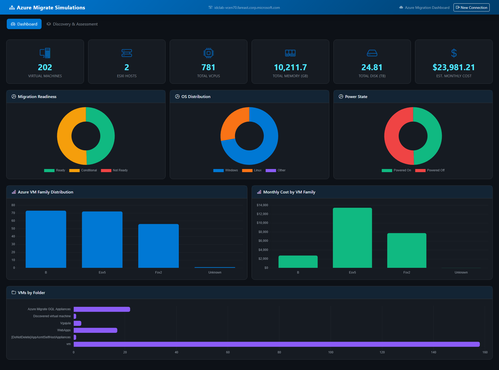
</details>

<details>
<summary><strong>Summary Cards Close-up</strong></summary>

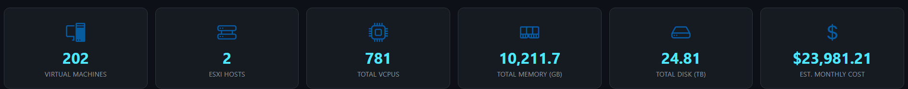
</details>

---

### 3. Discovery & Assessment

The second main tab provides the complete assessment workflow. The **left sidebar** contains:

- **Guest Credential Management** — Add Linux SSH and Windows WinRM credentials (multiple per OS) for guest-level workload discovery
- **Discovery Summary** — Real-time counts for VMs, vCPUs, RAM, disk, hosts, networks, file shares, and estimated cost
- **Performance Monitor** — Live status indicator (green/red), average CPU/memory/IOPS, sample count, start/stop/collect-now controls


<details>
<summary><strong>Sidebar Discovery Summary</strong></summary>

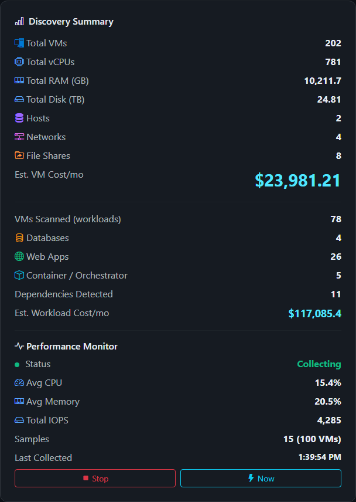
</details>

---

### 4. Inventory

The Inventory sub-tab provides a unified, searchable table of all discovered resources:

- **6 clickable filter cards** — VMs, Databases, Web Apps, Container/Orchestrators, Networks, File Shares
- **Full-text search** across all columns
- **Columns** — Parent VM, Type, Workload, Version, Port, Details

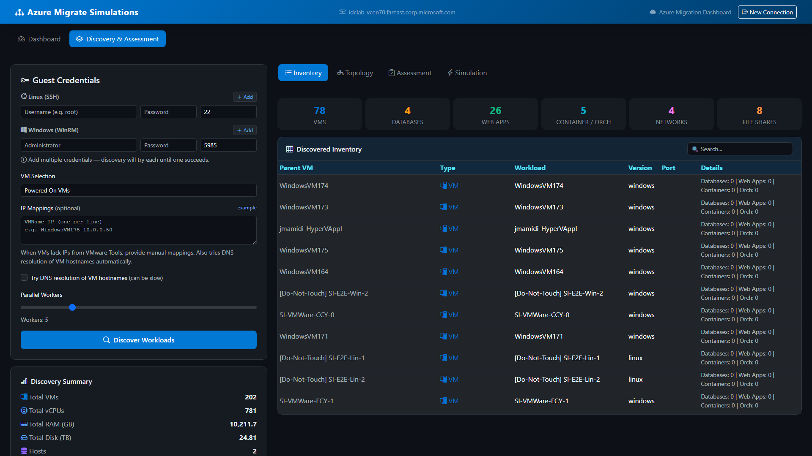

---

### 5. Topology Views

Interactive network graphs powered by vis-network:

**Infrastructure Topology** — Hierarchical view showing vCenter → Datacenter → ESXi Host → VM → Datastore/Network relationships. Nodes are color-coded by type and include a clickable legend.

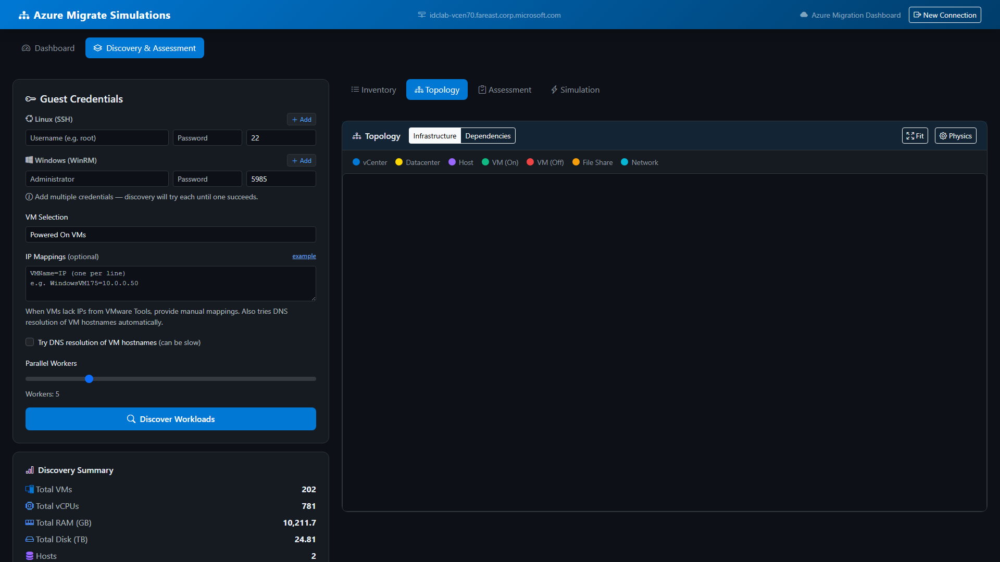

**Dependency Topology** — Cross-VM workload dependency graph built from established TCP connections discovered during guest probing. Directed edges show which VMs communicate with which services.

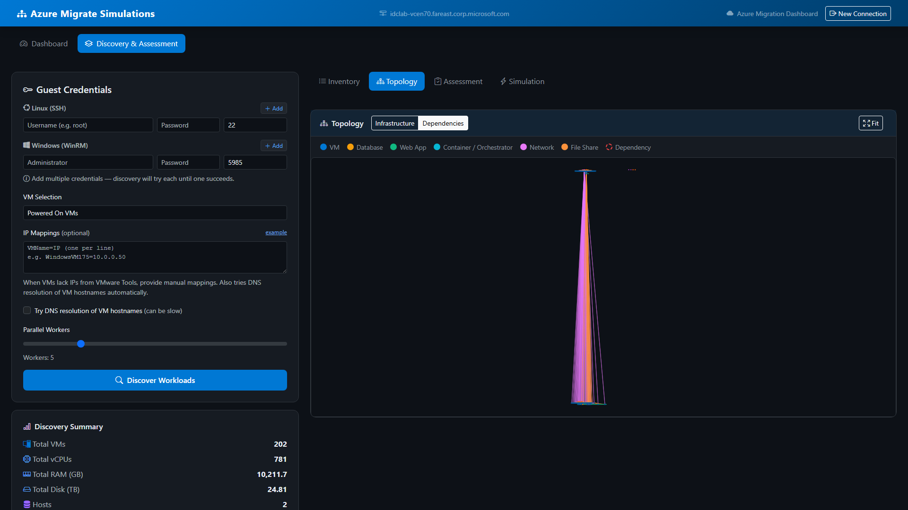

---

### 6. VM Assessment

Sortable, filterable table with per-VM Azure migration recommendations:

- **Filters** — Search by name, filter by readiness level, OS type, power state
- **Columns** — VM Name, Power State, OS, vCPU, RAM (GB), Disk (GB), Recommended Azure SKU, Disk Type, Monthly Cost ($), Readiness, Confidence Score, Issues
- **Click any row** to open the VM What-If analysis modal

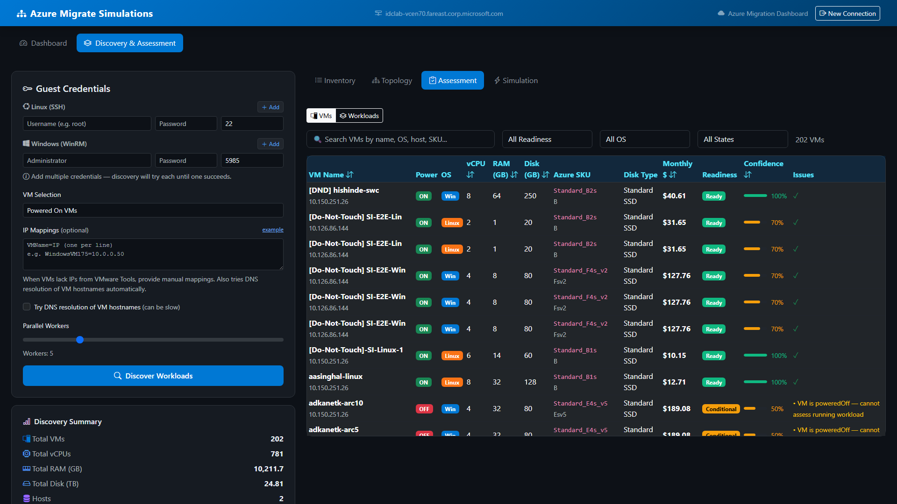

---

### 7. Workload Assessment

Per-workload Azure PaaS service recommendations after guest-level discovery:

- **Columns** — Workload Name, Source VM, Type, Current Version, Recommended Azure Service, Migration Approach, Complexity, CPU %, Memory (MB), Connections, Monthly Cost ($), Confidence
- **What-If button** on each row opens the workload scenario modeller

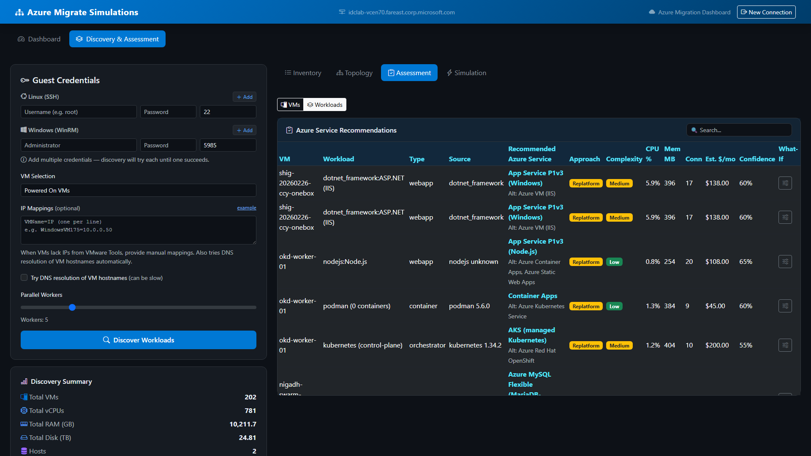

---

### 8. VM What-If Analysis

Full-screen modal for deep-dive VM analysis and scenario modelling:

**VM Details & Recommendation** — On-prem specs alongside the current Azure SKU recommendation with cost estimate.

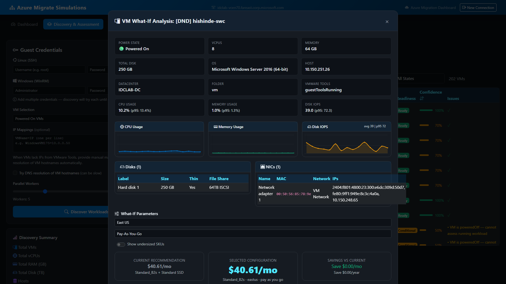

**Performance History** — Sparkline charts showing CPU utilisation, memory usage, disk IOPS, and network I/O over time with avg/min/max/p95 statistics.


**SKU Override Grid** — Browse the full Azure VM SKU catalog, select an alternative SKU, change region and pricing model, and see the cost impact instantly.


**Pricing Comparison Chart** — Visual comparison of original vs. what-if monthly cost with savings delta.


---

### 9. Workload What-If Analysis

Per-workload scenario modelling for Azure PaaS migration:

**Workload Details** — Shows the discovered workload info (type, version, port, source VM) and the recommended Azure service with migration steps.


**Azure Service Grid** — Browse alternative Azure services for the workload, compare costs and migration complexity.

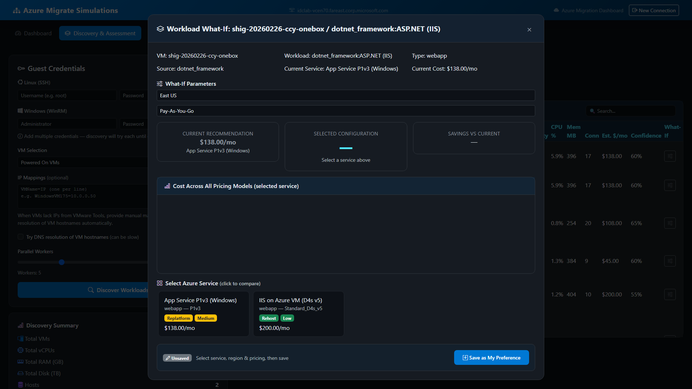

---

### 10. VM Simulation

Fleet-wide Azure migration cost simulation with planning tools:

- **Controls** — Select target Azure region (10 regions), pricing model (PAYG, 1yr/3yr RI, 1yr/3yr Savings Plan), number of migration waves (1–8), and optional VM filter
- **Cost Comparison** — Side-by-side on-prem vs. Azure monthly cost
- **12-Month Projection** — Line chart showing cumulative cost with wave-based migration rollout
- **Migration Wave Plan** — VMs grouped into waves with drag-and-drop re-assignment
- **What-If Comparison** — Per-VM original vs. adjusted SKU/region/pricing with cost deltas

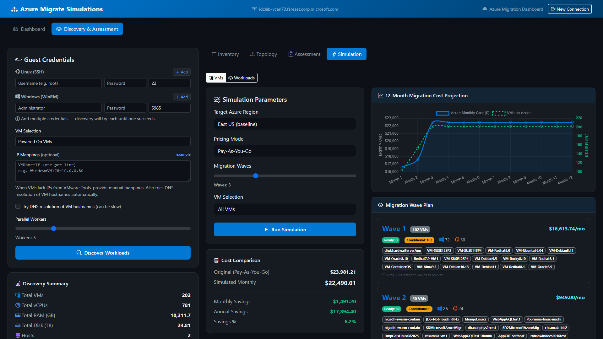

<details>
<summary><strong>VM Simulation — Full Page</strong></summary>

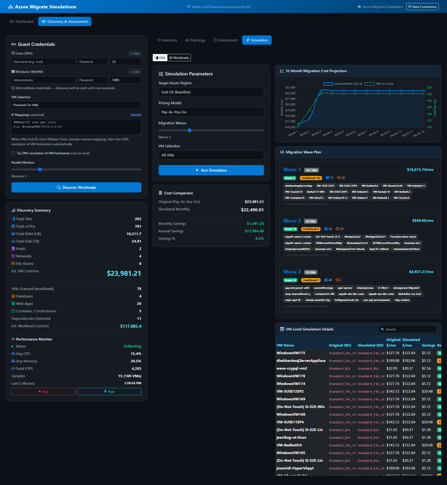
</details>

---

### 11. Workload Simulation

Workload-level Azure PaaS migration cost simulation:

- **Controls** — Region, pricing model (PAYG, RI, Dev/Test, EA), wave count, workload type filter
- **Per-Type Cost Cards** — Cost breakdown by workload category (databases, web apps, containers)
- **12-Month Projection** — Cumulative cost chart with workload migration rollout
- **Wave Plan** — Workloads grouped into migration waves

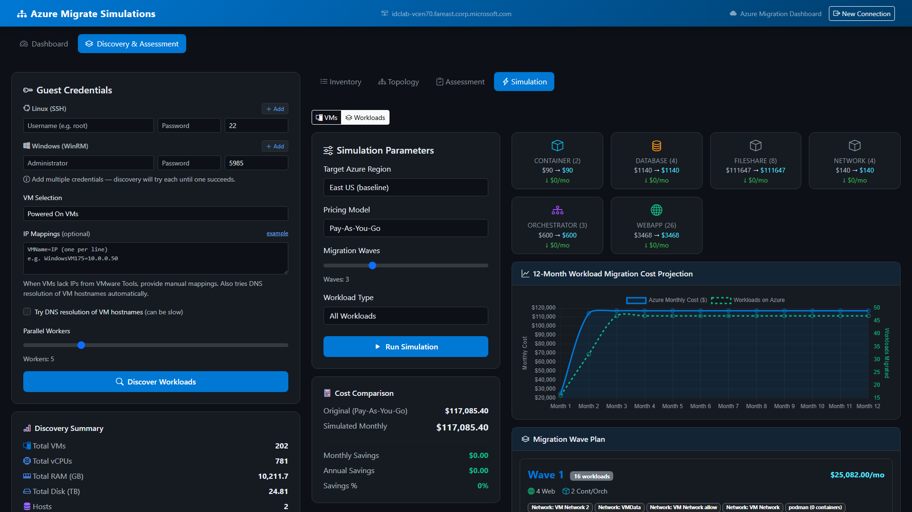

<details>
<summary><strong>Workload Simulation — Full Page</strong></summary>

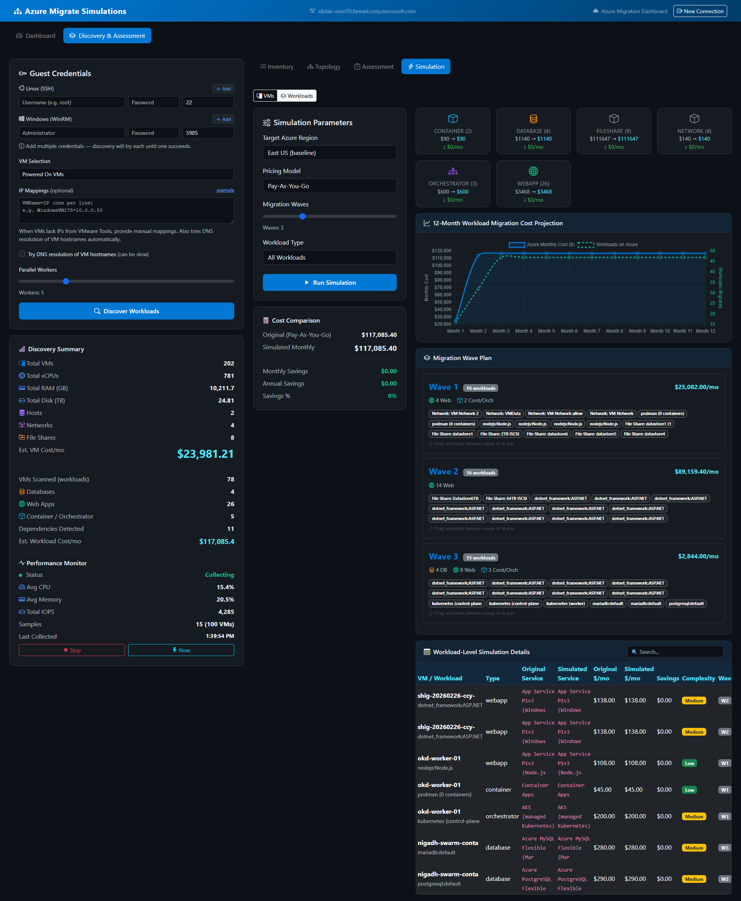
</details>

---

## Architecture

```
┌─────────────────────────────────────────────────────────────┐
│                   Flask Web Dashboard                       │
│               (web/app.py — 43 REST endpoints)              │
│                                                             │
│  ┌──────────┐  ┌──────────┐  ┌──────────┐  ┌────────────┐  │
│  │Dashboard │  │Inventory │  │Assessment│  │ Simulation │  │
│  │ Charts   │  │ Tables   │  │ What-If  │  │ Wave Plan  │  │
│  └──────────┘  └──────────┘  └──────────┘  └────────────┘  │
├─────────────────────────────────────────────────────────────┤
│                   Core Engine Layer                          │
│  ┌─────────────────┐  ┌─────────────────────────────────┐   │
│  │vcenter_discovery│  │     guest_discovery             │   │
│  │  (pyVmomi)      │  │  (SSH/WinRM → DBs, Web, etc.)  │   │
│  └────────┬────────┘  └───────────────┬─────────────────┘   │
│           │                           │                     │
│  ┌────────▼────────┐  ┌───────────────▼─────────────────┐   │
│  │ azure_mapping   │  │     workload_mapping            │   │
│  │ (IaaS SKU rec.) │  │  (PaaS service rec. + playbooks)│   │
│  └─────────────────┘  └─────────────────────────────────┘   │
├─────────────────────────────────────────────────────────────┤
│  ┌─────────────────┐  ┌─────────────────┐  ┌────────────┐  │
│  │ twin_builder    │  │azure_provisioning│  │visualization│ │
│  │ (ADT creation)  │  │ (ARM setup)      │  │ (CLI/Rich) │  │
│  └─────────────────┘  └─────────────────┘  └────────────┘  │
└─────────────────────────────────────────────────────────────┘
```

---

## Tech Stack

| Category | Technology | Version |
|---|---|---|
| Language | Python | ≥ 3.10 |
| Web Framework | Flask | — |
| CSS Framework | Bootstrap | 5.3.3 |
| Icons | Bootstrap Icons | 1.11.3 |
| Charts | Chart.js | 4.4.1 |
| Network Graphs | vis-network | 9.1.6 |
| CLI Output | Rich | ≥ 13.0.0 |
| VMware SDK | pyVmomi | ≥ 8.0.0.1 |
| Azure SDKs | azure-digitaltwins-core, azure-identity, azure-mgmt-* | various |
| Remote Access | paramiko (SSH), pywinrm (WinRM) | runtime |
| Theme | Dark mode (custom CSS) | — |
| Data Persistence | JSON files (`data/` directory) | — |

---

## Quick Start

### Prerequisites

- Python ≥ 3.10
- [uv](https://docs.astral.sh/uv/) package manager (recommended) or pip

### Install & Run

```bash
# Clone the repository
git clone <repo-url>
cd azure-migrate-simulations

# Install dependencies
uv sync

# Launch the web dashboard
cd web
python app.py
# Open http://localhost:5000
```

### Load Sample Data

If you don't have a vCenter environment, you can upload the included sample discovery report:

```bash
# The connect screen has an "Upload Report" option
# Use the file: discovery_report.json
```

---

## CLI Usage

The project also includes a CLI for automated discovery-to-digital-twin workflows:

```bash
uv run dt-migrate --help

# Discover only (no Azure Digital Twin creation)
uv run dt-migrate --discover-only --export report.json

# Full workflow: discover → map → provision → create twins
uv run dt-migrate --region eastus
```

### CLI Flags

| Flag | Description |
|---|---|
| `--discover-only` | Run vCenter discovery without creating Azure Digital Twins |
| `--skip-twin` | Skip Azure Digital Twins creation |
| `--skip-perf` | Skip performance counter collection |
| `--export <file>` | Export discovery data to JSON |
| `--region <region>` | Target Azure region (default: `eastus`) |
| `--verbose` | Enable verbose debug output |

---

## API Reference

The web dashboard exposes **43 REST API endpoints** across 7 categories:

<details>
<summary><strong>Connection & Status (5 endpoints)</strong></summary>

| Method | Endpoint | Description |
|---|---|---|
| `POST` | `/api/connect` | Connect to vCenter and start discovery |
| `GET` | `/api/discover/status` | Poll discovery progress |
| `POST` | `/api/disconnect` | Reset connection state |
| `POST` | `/api/upload` | Upload a saved discovery JSON |
| `GET` | `/api/status` | Overall app status |
</details>

<details>
<summary><strong>Infrastructure Data (6 endpoints)</strong></summary>

| Method | Endpoint | Description |
|---|---|---|
| `GET` | `/api/summary` | Dashboard summary stats |
| `GET` | `/api/topology` | Infrastructure topology graph |
| `GET` | `/api/vms` | List all discovered VMs |
| `GET` | `/api/hosts` | List ESXi hosts |
| `GET` | `/api/fileshares` | List datastores/file shares |
| `GET` | `/api/networks` | List discovered networks |
</details>

<details>
<summary><strong>Assessment (2 endpoints)</strong></summary>

| Method | Endpoint | Description |
|---|---|---|
| `GET` | `/api/recommendations` | Azure VM SKU recommendations |
| `GET` | `/api/sku_catalog` | Available Azure VM SKU catalog |
</details>

<details>
<summary><strong>VM Simulation & What-If (9 endpoints)</strong></summary>

| Method | Endpoint | Description |
|---|---|---|
| `POST` | `/api/simulate` | Run fleet-wide cost simulation |
| `POST` | `/api/simulate_vm` | Per-VM what-if scenario |
| `POST` | `/api/simulate_comparison` | Compare original vs. overrides |
| `GET` | `/api/regions` | Azure regions + cost multipliers |
| `GET` | `/api/pricing_models` | Available pricing models |
| `GET` | `/api/whatif_overrides` | Get saved what-if overrides |
| `POST` | `/api/whatif_overrides` | Save a what-if override |
| `DELETE` | `/api/whatif_overrides/<vm>` | Delete one override |
| `DELETE` | `/api/whatif_overrides` | Clear all overrides |
</details>

<details>
<summary><strong>Workload Discovery & What-If (11 endpoints)</strong></summary>

| Method | Endpoint | Description |
|---|---|---|
| `POST` | `/api/workloads/discover` | Trigger guest-level workload discovery |
| `GET` | `/api/workloads/status` | Poll workload discovery progress |
| `GET` | `/api/workloads/results` | Get workload recommendations |
| `GET` | `/api/workloads/topology` | Dependency topology graph |
| `POST` | `/api/workloads/whatif` | Per-workload what-if scenario |
| `POST` | `/api/workloads/simulate` | Workload fleet simulation |
| `GET` | `/api/workloads/whatif_overrides` | Get workload overrides |
| `POST` | `/api/workloads/whatif_overrides` | Save workload override |
| `DELETE` | `/api/workloads/whatif_overrides/<key>` | Delete one override |
| `DELETE` | `/api/workloads/whatif_overrides` | Clear all overrides |
| `GET` | `/api/data/files` | List saved data files |
</details>

<details>
<summary><strong>Performance Monitoring (9 endpoints)</strong></summary>

| Method | Endpoint | Description |
|---|---|---|
| `GET` | `/api/perf/status` | Collector status (running, samples, interval) |
| `POST` | `/api/perf/start` | Start background collector (15-min interval) |
| `POST` | `/api/perf/stop` | Stop collector |
| `POST` | `/api/perf/collect` | Collect a sample immediately |
| `GET` | `/api/perf/vm/<name>` | VM time-series perf data |
| `GET` | `/api/perf/vm/<name>/summary` | VM perf stats (avg/min/max/p95) |
| `GET` | `/api/perf/workloads` | Monitored workloads with perf summaries |
| `GET` | `/api/perf/workload/<key>` | Workload time-series perf data |
| `GET` | `/api/perf/summary` | Fleet-wide perf summary |
</details>

---

## Project Structure

```
azure-migrate-simulations/
├── web/
│   ├── app.py                         # Flask backend (43 endpoints, 2269 lines)
│   └── templates/
│       └── index.html                 # Single-page dashboard (3813 lines)
├── src/digital_twin_migrate/
│   ├── models.py                      # Infrastructure data models (Pydantic)
│   ├── models_workload.py             # Workload data models
│   ├── config.py                      # Configuration management
│   ├── vcenter_discovery.py           # vCenter discovery engine (pyVmomi)
│   ├── guest_discovery.py             # Guest-level workload discovery (SSH/WinRM)
│   ├── azure_mapping.py              # Azure VM SKU recommendation engine
│   ├── workload_mapping.py           # Azure PaaS service mapping (24 playbooks)
│   ├── azure_provisioning.py         # Azure Digital Twins provisioning
│   ├── twin_builder.py               # Digital twin creation
│   ├── visualization.py              # CLI Rich console output
│   └── main.py                       # CLI entry point
├── data/                              # Runtime data (discovery results, perf history)
├── docs/screenshots/                  # Dashboard screenshots
├── discovery_report.json              # Sample discovery data
├── pyproject.toml                     # Project config & dependencies
└── README.md
```

---

## License

This project is provided as-is for demonstration and assessment purposes.
