# Azure Migrate Simulations

> Discover VMware vCenter workloads and simulate Azure migration scenarios — assess, plan, and optimise your move to Azure from a single dashboard.

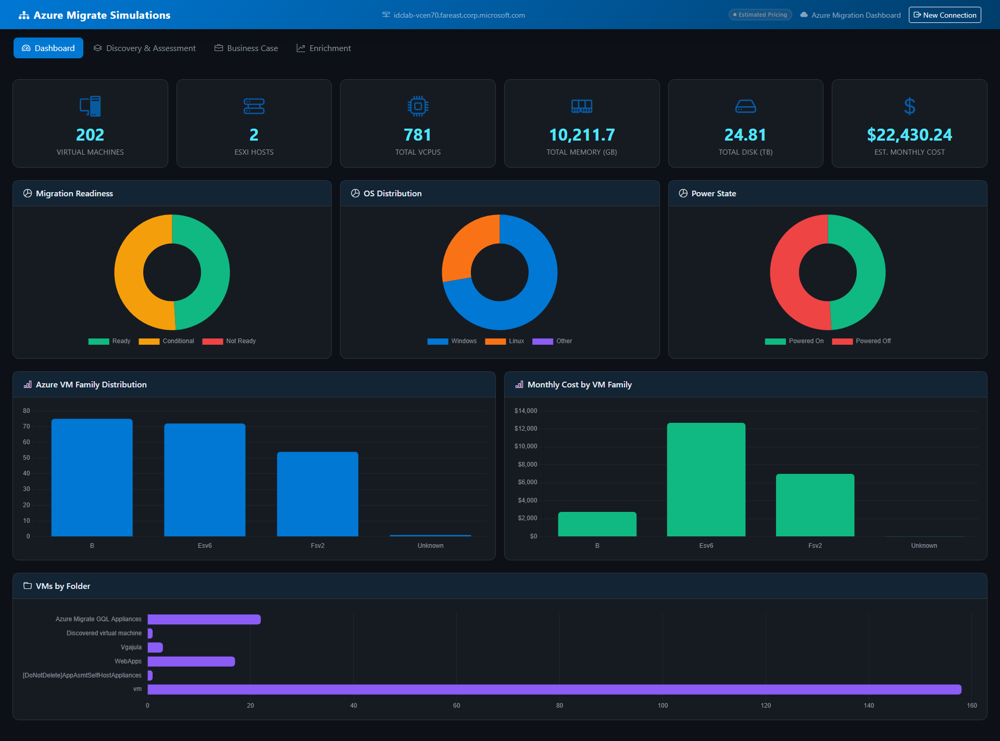

---

## Table of Contents

- [Features Overview](#features-overview)
- [Feature Details](#feature-details)
  - [1. Connect & Data Ingestion](#1-connect--data-ingestion)
  - [2. Dashboard](#2-dashboard)
  - [3. Discovery & Assessment](#3-discovery--assessment)
    - [Inventory](#inventory)
    - [Topology Views](#topology-views)
    - [VM Assessment](#vm-assessment)
    - [Workload Assessment](#workload-assessment)
    - [VM Simulation & What-If](#vm-simulation--what-if)
    - [Workload Simulation & What-If](#workload-simulation--what-if)
    - [Vulnerability & SLA](#vulnerability--sla)
  - [4. Business Case](#4-business-case)
  - [5. Enrichment Data Loop](#5-enrichment-data-loop)
  - [6. Performance Monitoring](#6-performance-monitoring)
  - [7. CSV Export](#7-csv-export)
- [Architecture](#architecture)
- [Tech Stack](#tech-stack)
- [Quick Start](#quick-start)
- [CLI Usage](#cli-usage)
- [API Reference](#api-reference)
- [Project Structure](#project-structure)
- [Security](#security)
- [License](#license)

---

## Features Overview

| Category | Highlights |
|---|---|
| **vCenter Discovery** | Auto-discover datacenters, clusters, ESXi hosts, VMs, datastores, networks via pyVmomi |
| **Guest-Level Discovery** | SSH (Linux) and WinRM (Windows) probes detect databases, web apps, containers, orchestrators |
| **Infrastructure Topology** | Interactive vis-network graphs showing vCenter hierarchy and cross-VM dependency maps |
| **Azure SKU Recommendations** | Right-size VMs to 20+ Azure SKUs across B/D/E/F families with readiness and confidence scoring |
| **Workload PaaS Mapping** | Map 7 DB engines, 8 web runtimes, 4 container runtimes to Azure PaaS services with migration playbooks |
| **What-If Analysis** | Per-VM and per-workload scenario modelling — change SKU, region, pricing, and see cost deltas instantly |
| **Migration Simulation** | Fleet-wide cost projection, 12-month charts, migration wave planning with drag-and-drop re-assignment |
| **Performance Monitoring** | Background collector captures CPU, memory, IOPS, network I/O every 15 minutes with sparkline charts |
| **Business Case Generator** | Full on-prem TCO vs Azure cost comparison with ROI, payback period, and strategic recommendations |
| **Enrichment Data Loop** | Import telemetry from Dynatrace, New Relic, Datadog, Splunk, Prometheus, AppDynamics, Zabbix to boost confidence scores |
| **Vulnerability & SLA** | OS lifecycle tracking, software end-of-support detection, and licensing guidance for migration planning |
| **CSV Export** | Download VM and workload assessment data as CSV for offline analysis |
| **57 REST API Endpoints** | Programmatic access to every capability — connection, discovery, assessment, simulation, enrichment, perf data |

---

## Feature Details

### 1. Connect & Data Ingestion

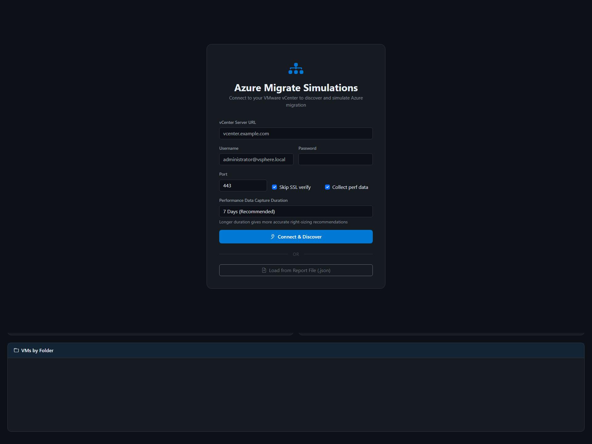

The landing page provides two ways to start:

**Live vCenter Connection**
- Enter your vCenter Server URL, username, and password
- The app connects via pyVmomi and automatically discovers the entire VMware infrastructure
- Discovery runs asynchronously with a progress indicator showing status in real time
- Supports SSL-disabled connections for lab environments

**Upload Discovery Report**
- Upload a previously exported discovery JSON file (e.g. `discovery_report.json`)
- Instantly loads all VMs, hosts, datastores, networks, and recommendations
- Useful for demo environments, offline analysis, or sharing results between teams

**How it works:**
1. User provides vCenter credentials or uploads a JSON file via the Connect screen
2. The backend calls `vcenter_discovery.discover()` which connects to the vCenter API
3. It enumerates all datacenters, clusters, ESXi hosts, VMs, datastores, and networks
4. For each VM, it collects: name, power state, guest OS, CPU count, memory (MB), disk sizes, IP addresses, VMware Tools status, folder path
5. The Azure mapping engine (`azure_mapping.py`) generates SKU recommendations for every VM
6. All data is stored in-memory and optionally persisted to `data/` as JSON files

**API Endpoints:**
| Method | Endpoint | Description |
|---|---|---|
| `POST` | `/api/connect` | Connect to vCenter and start discovery |
| `GET` | `/api/discover/status` | Poll discovery progress |
| `POST` | `/api/disconnect` | Reset connection state |
| `POST` | `/api/upload` | Upload a saved discovery JSON |
| `GET` | `/api/status` | Overall app status |

---

### 2. Dashboard


After connecting, the Dashboard tab presents a fleet-wide overview of your VMware environment with Azure migration insights.

**Summary Cards (6 cards):**
- **VMs** — Total number of discovered virtual machines
- **ESXi Hosts** — Physical hypervisors in the vCenter environment
- **Total vCPUs** — Aggregate virtual CPU count across all VMs
- **Memory (GB)** — Total allocated RAM across the fleet
- **Disk (TB)** — Combined provisioned storage
- **Est. Azure Cost/mo** — Estimated monthly Azure cost based on recommended SKUs

**Interactive Charts (6 charts):**
1. **Migration Readiness** (doughnut) — Breaks down VMs by readiness level: Ready, Ready with Conditions, Not Ready, Unknown
2. **OS Distribution** (doughnut) — Windows vs Linux vs Other guest OS breakdown
3. **Power State** (doughnut) — Powered On vs Powered Off vs Suspended counts
4. **Azure VM Family Distribution** (horizontal bar) — Count of VMs recommended for each Azure VM family (B-series, D-series, E-series, F-series, etc.)
5. **Monthly Cost by Family** (horizontal bar) — Azure cost projection grouped by VM family
6. **VMs by Folder** (horizontal bar) — VM count by vCenter folder hierarchy, showing infrastructure organisation

**How it works:**
1. On page load, the frontend calls `GET /api/summary` to fetch aggregated statistics
2. The backend computes totals from the loaded VM and recommendation data
3. Chart.js renders interactive doughnut and bar charts with Azure-themed colour scheme
4. Charts are clickable for filtering and support hover tooltips with detailed values
5. Summary cards update in real time when data changes (e.g. after enrichment upload)

**API Endpoints:**
| Method | Endpoint | Description |
|---|---|---|
| `GET` | `/api/summary` | Dashboard summary statistics and chart data |

---

### 3. Discovery & Assessment

The second main tab contains the complete assessment workflow with a sidebar drawer for configuration and five sub-tabs for different views.

**Sidebar Drawer (offcanvas, right side):**

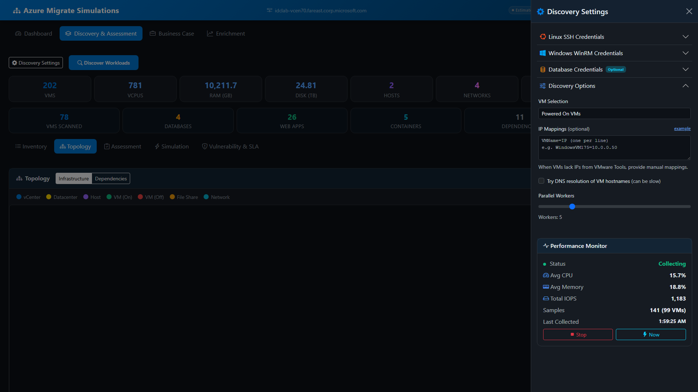
- **Guest Credential Management** — Add multiple Linux SSH and Windows WinRM credential sets for guest-level workload discovery
- **Database Credentials** — Optional database connection credentials (SQL Server, MySQL, PostgreSQL, MongoDB, Redis, Oracle, MariaDB) for deep database discovery
- **Discovery Options** — VM selection filter (Powered On, All, Linux Only, Windows Only), manual IP mappings, DNS resolution toggle, parallel worker slider (1–20)
- **Discovery Summary** — Real-time counts for VMs, vCPUs, RAM, disk, hosts, networks, file shares, and estimated cost
- **Performance Monitor** — Live collector status (green/red dot), average CPU/memory/IOPS, sample count, and start/stop/collect-now controls

---

#### Inventory

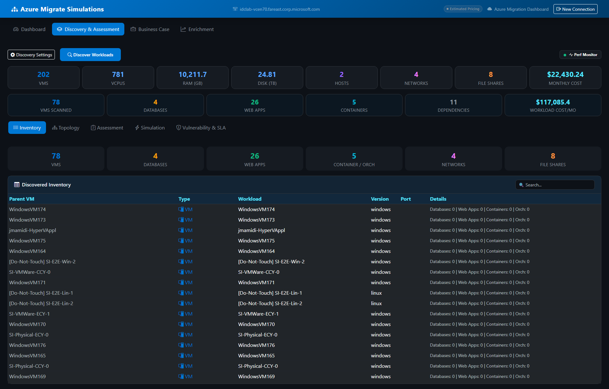

The Inventory sub-tab provides a unified, searchable table of all discovered resources.

**Filter Cards (6 clickable cards):**
- **VMs** — Total virtual machines
- **Databases** — Discovered database instances (SQL Server, MySQL, PostgreSQL, etc.)
- **Web Apps** — Detected web servers and applications (IIS, Apache, Nginx, Tomcat, etc.)
- **Containers** — Container runtimes detected (Docker, containerd, Podman)
- **Networks** — Discovered vSphere networks and port groups
- **File Shares** — Datastores and shared storage

**How it works:**
1. Click any filter card to toggle filtering by that resource type
2. Use the full-text search box to search across all columns (parent VM, type, workload, version, port, details)
3. The table auto-populates from both vCenter discovery data (VMs, networks, datastores) and guest-level workload discovery results (databases, web apps, containers)
4. Each row shows: Parent VM, Resource Type, Workload Name, Version, Port, and Details

**API Endpoints:**
| Method | Endpoint | Description |
|---|---|---|
| `GET` | `/api/vms` | List all discovered VMs with Azure recommendations |
| `GET` | `/api/hosts` | List ESXi hosts |
| `GET` | `/api/fileshares` | List datastores/file shares |
| `GET` | `/api/networks` | List discovered networks |
| `GET` | `/api/data/files` | List saved data files |

---

#### Topology Views

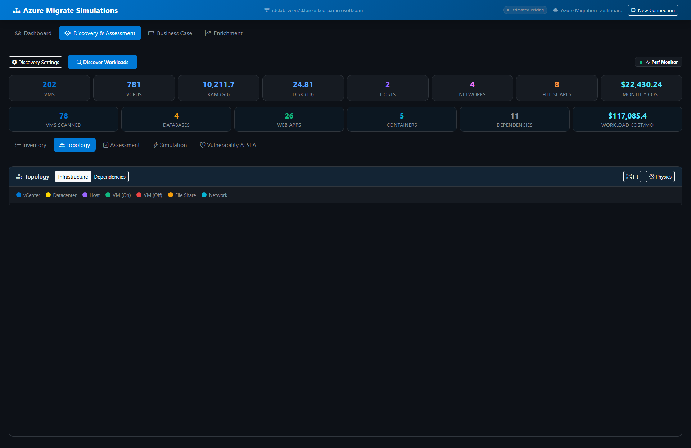

Interactive network graphs powered by vis-network with two views:

**Infrastructure Topology:**
- Hierarchical layout showing vCenter → Datacenter → Cluster → ESXi Host → VM → Datastore/Network relationships
- Nodes are colour-coded by type (blue for VMs, green for hosts, orange for datastores, purple for networks)
- Clickable legend toggles node types for filtering
- Hover tooltips show specs (CPU cores, memory, ESXi version for hosts; vCPU, RAM, disk for VMs)
- Physics-based layout with drag-and-zoom navigation

**Dependency Topology:**
- Cross-VM workload dependency graph built from TCP connections discovered during guest probing
- Directed edges show which VMs communicate with which services (e.g. web server → database server)
- Useful for identifying migration groups — VMs that must migrate together due to network dependencies
- Edge labels show the service type and port

**How it works:**
1. Frontend calls `GET /api/topology` for infrastructure graph data
2. Backend builds a vis-network compatible node/edge dataset from the discovery hierarchy
3. For dependency topology, `GET /api/workloads/topology` analyses established TCP connections from guest discovery
4. vis-network renders the interactive graph with physics simulation
5. Users can click nodes to open the VM What-If modal, drag nodes to rearrange, and zoom/pan freely

**API Endpoints:**
| Method | Endpoint | Description |
|---|---|---|
| `GET` | `/api/topology` | Infrastructure topology graph (nodes + edges) |
| `GET` | `/api/workloads/topology` | Workload dependency topology graph |

---

#### VM Assessment

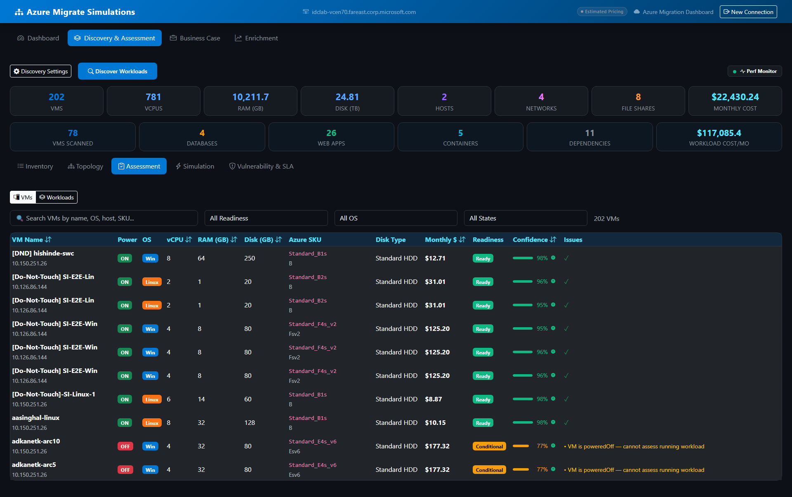

Sortable, filterable table with per-VM Azure migration recommendations.

**Filters:**
- Full-text search by VM name
- Filter by readiness level (Ready, Ready with Conditions, Not Ready)
- Filter by OS type (Windows, Linux)
- Filter by power state (Powered On, Powered Off)

**Table Columns:**
| Column | Description |
|---|---|
| VM Name | Name of the discovered virtual machine |
| Power State | Current power state (poweredOn, poweredOff, suspended) |
| OS | Guest operating system (Windows Server 2019, Ubuntu 22.04, etc.) |
| vCPU | Number of virtual CPUs allocated |
| RAM (GB) | Memory allocated in gigabytes |
| Disk (GB) | Total provisioned disk capacity |
| Azure SKU | Recommended Azure VM size (e.g. Standard_D4s_v5) |
| Disk Type | Recommended Azure managed disk type (Premium SSD, Standard SSD, Standard HDD) |
| Monthly Cost ($) | Estimated monthly Azure cost for the recommended SKU |
| Readiness | Migration readiness assessment (Ready, Ready with Conditions, Not Ready) |
| Confidence | Confidence score (0–98) indicating assessment reliability. Boosted by enrichment data |
| Issues | Number of migration issues or blockers identified |

**How it works:**
1. Frontend calls `GET /api/vms` to fetch all VMs with recommendations
2. The `azure_mapping.py` engine evaluates each VM's CPU, memory, disk, and OS against the Azure SKU catalog
3. It assigns a readiness level based on compatibility checks (e.g. unsupported OS, excessive disk size)
4. Confidence scores start at 50–70 from vCenter data alone and can be boosted up to +30 by enrichment data
5. Clicking any row opens the VM What-If modal for deep-dive analysis
6. If enrichment data is loaded, confidence scores are recalculated with the monitoring boost

**API Endpoints:**
| Method | Endpoint | Description |
|---|---|---|
| `GET` | `/api/vms` | List VMs with recommendations and confidence scores |
| `GET` | `/api/recommendations` | Azure VM SKU recommendations |
| `GET` | `/api/sku_catalog` | Full Azure VM SKU catalog |

---

#### Workload Assessment

Per-workload Azure PaaS service recommendations after guest-level discovery.

**Table Columns:**
| Column | Description |
|---|---|
| Workload Name | Name of the discovered workload (e.g. "MySQL 8.0", "IIS 10.0") |
| Source VM | The VM hosting this workload |
| Type | Workload category: database, webapp, container, orchestrator |
| Version | Detected software version |
| Azure Service | Recommended Azure PaaS service (e.g. Azure SQL Database, Azure App Service) |
| Migration Approach | Rehost, Replatform, or Refactor |
| Complexity | Migration complexity rating (Low, Medium, High) |
| CPU % | Average CPU utilisation of the workload |
| Memory (MB) | Memory consumption in megabytes |
| Connections | Active TCP connection count |
| Monthly Cost ($) | Estimated Azure PaaS monthly cost |
| Confidence | Assessment confidence score |

**Supported Workload Types:**
- **Databases (7 engines):** SQL Server, MySQL, PostgreSQL, MariaDB, MongoDB, Oracle, Redis
- **Web Applications (8 runtimes):** IIS, Apache HTTPD, Nginx, Tomcat, Node.js, .NET Core/Kestrel, Python (Flask/Django/Gunicorn), PHP-FPM
- **Containers (4 runtimes):** Docker, containerd, Podman, CRI-O
- **Orchestrators:** Kubernetes (kubelet/kube-apiserver)

**How it works:**
1. User provides SSH/WinRM credentials and triggers workload discovery via the sidebar
2. The backend SSHes into Linux VMs and uses WinRM for Windows VMs to scan running processes, services, and listening ports
3. `guest_discovery.py` identifies databases, web servers, containers, and orchestrators from process lists
4. `workload_mapping.py` maps each discovered workload to an Azure PaaS service using 24 migration playbooks
5. Each playbook includes migration steps, complexity rating, and compatibility notes
6. Results appear in the Workload Assessment table; clicking "What-If" opens the workload scenario modeller

**API Endpoints:**
| Method | Endpoint | Description |
|---|---|---|
| `POST` | `/api/workloads/discover` | Trigger guest-level workload discovery |
| `GET` | `/api/workloads/status` | Poll workload discovery progress |
| `GET` | `/api/workloads/results` | Get workload recommendations |
| `POST` | `/api/databases/discover` | Trigger deep database discovery |

---

#### VM Simulation & What-If

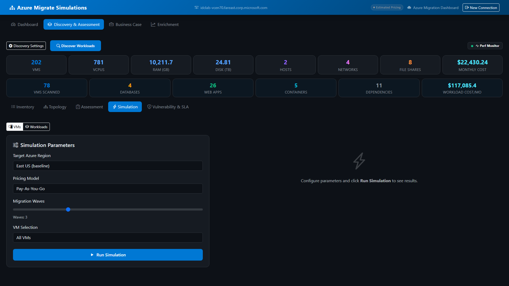

Two levels of scenario modelling: per-VM What-If and fleet-wide Simulation.

**Per-VM What-If (full-screen modal):**

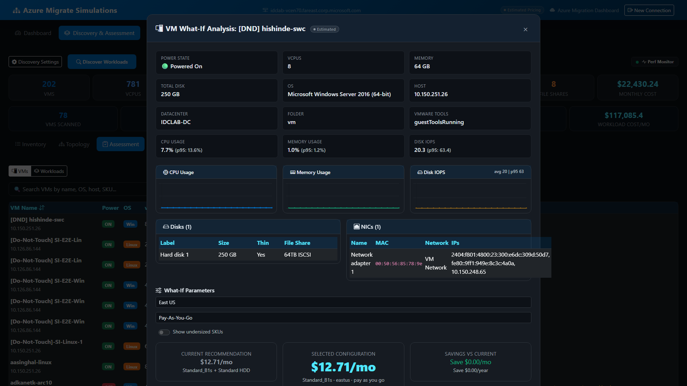
- **VM Details** — On-prem specs (CPU, RAM, disk, OS, IP) alongside the Azure SKU recommendation with cost estimate
- **Performance Sparklines** — CPU utilisation, memory usage, disk IOPS, and network I/O over time with avg/min/max/P95 statistics (requires performance data collection or enrichment)
- **SKU Override Grid** — Browse the full Azure VM SKU catalog (20+ SKUs), select an alternative, and see cost impact
- **Region & Pricing Override** — Change target Azure region (10 regions with cost multipliers) and pricing model (PAYG, 1yr/3yr Reserved Instance, 1yr/3yr Savings Plan)
- **Pricing Comparison Chart** — Visual bar chart comparing original vs. what-if monthly cost with savings percentage
- **Persist Overrides** — Save what-if selections so they carry through to fleet-wide simulation

**Fleet-Wide VM Simulation:**
- **Controls** — Target region, pricing model, number of migration waves (1–8), VM name filter
- **Cost Comparison** — Side-by-side on-prem vs Azure total monthly cost with savings percentage
- **12-Month Projection** — Line chart showing cumulative cost with wave-based migration rollout (VMs migrating over time)
- **Migration Wave Plan** — VMs grouped into migration waves with drag-and-drop re-assignment between waves
- **What-If Comparison Table** — Per-VM breakdown showing original SKU vs. adjusted SKU/region/pricing with cost deltas
- **Live Pricing** — Optionally pulls real-time prices from the Azure Retail Prices API

**How it works:**
1. The What-If modal is opened by clicking a VM row in the assessment table
2. Frontend calls `POST /api/simulate_vm` with the VM name and optional overrides (SKU, region, pricing model)
3. Backend recalculates costs using Azure Retail Prices API (with fallback to hardcoded prices)
4. Region cost multipliers and Reserved Instance discounts are applied to the base price
5. Overrides are saved via `POST /api/whatif_overrides` and used in fleet simulation
6. Fleet simulation (`POST /api/simulate`) calculates total costs, generates 12-month projection, and plans migration waves
7. Migration waves distribute VMs evenly; users can drag VMs between waves in the UI

**API Endpoints:**
| Method | Endpoint | Description |
|---|---|---|
| `POST` | `/api/simulate` | Run fleet-wide cost simulation |
| `POST` | `/api/simulate_vm` | Per-VM what-if scenario |
| `POST` | `/api/simulate_comparison` | Compare original vs. override costs |
| `GET` | `/api/regions` | Azure regions with cost multipliers |
| `GET` | `/api/pricing_models` | Available pricing models |
| `GET` | `/api/pricing/status` | Live pricing API status |
| `POST` | `/api/pricing/refresh` | Refresh live pricing from Azure |
| `GET` | `/api/whatif_overrides` | Get saved per-VM what-if overrides |
| `POST` | `/api/whatif_overrides` | Save a what-if override |
| `DELETE` | `/api/whatif_overrides/<vm>` | Delete one VM override |
| `DELETE` | `/api/whatif_overrides` | Clear all VM overrides |

---

#### Workload Simulation & What-If

Workload-level Azure PaaS migration cost simulation.

**Per-Workload What-If (modal):**
- **Workload Details** — Discovered workload info (type, version, port, source VM) and recommended Azure PaaS service
- **Migration Playbook** — Step-by-step migration guide with complexity rating
- **Azure Service Grid** — Browse alternative Azure services for the workload, compare costs and migration complexity
- **Pricing Override** — Change region and pricing model, see cost impact

**Fleet-Wide Workload Simulation:**
- **Controls** — Region, pricing model (PAYG, RI, Dev/Test, EA), wave count, workload type filter
- **Per-Type Cost Cards** — Cost breakdown by workload category (databases, web apps, containers)
- **12-Month Projection** — Cumulative cost chart with workload migration rollout schedule
- **Wave Plan** — Workloads grouped into migration waves

**How it works:**
1. Workload What-If is triggered by clicking "What-If" on a workload assessment row
2. `POST /api/workloads/whatif` returns the workload details, recommended PaaS service, and alternative services with costs
3. Each alternative includes migration complexity, cost estimate, and a step-by-step migration playbook
4. Fleet simulation (`POST /api/workloads/simulate`) aggregates all workload costs and projects them over 12 months
5. Costs can be broken down by workload type (databases cost more than containers, etc.)

**API Endpoints:**
| Method | Endpoint | Description |
|---|---|---|
| `POST` | `/api/workloads/whatif` | Per-workload what-if scenario |
| `POST` | `/api/workloads/simulate` | Fleet-wide workload simulation |
| `GET` | `/api/workloads/whatif_overrides` | Get saved workload overrides |
| `POST` | `/api/workloads/whatif_overrides` | Save a workload override |
| `DELETE` | `/api/workloads/whatif_overrides/<key>` | Delete one workload override |
| `DELETE` | `/api/workloads/whatif_overrides` | Clear all workload overrides |

---

#### Vulnerability & SLA

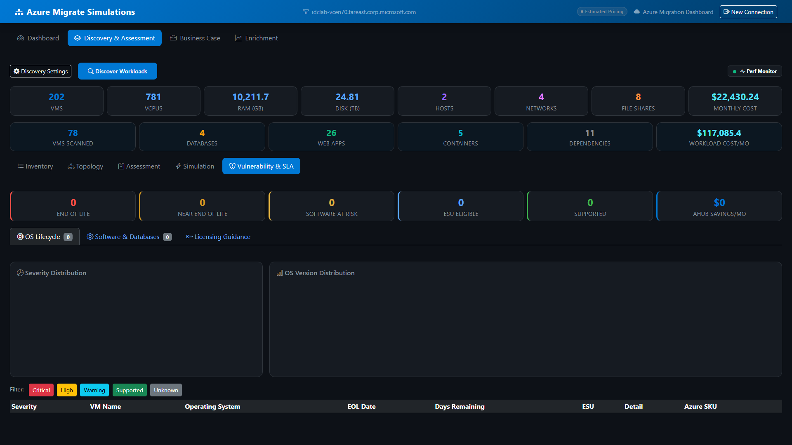

The Vulnerability & SLA sub-tab identifies security risks and end-of-support issues across the discovered fleet.

**Summary Cards (4 cards):**
- **Total VMs Scanned** — Number of VMs analysed
- **Critical EOL** — VMs running end-of-life operating systems with no security patches
- **Warning** — VMs running software approaching end-of-support
- **Compliant** — VMs running fully supported software versions

**Three Analysis Sub-Tabs:**

1. **OS Lifecycle** — Evaluates every VM's operating system against a built-in lifecycle database
   - Detects end-of-life OS versions (e.g. Windows Server 2012, CentOS 6, Ubuntu 16.04)
   - Shows lifecycle status: Supported, Extended Support, End of Life
   - Provides upgrade recommendations and Azure migration guidance
   - Table columns: VM Name, OS, Version, Lifecycle Status, End Date, Risk Level, Recommendation

2. **Software Lifecycle** — Evaluates detected software (databases, web servers, runtimes) against end-of-support dates

   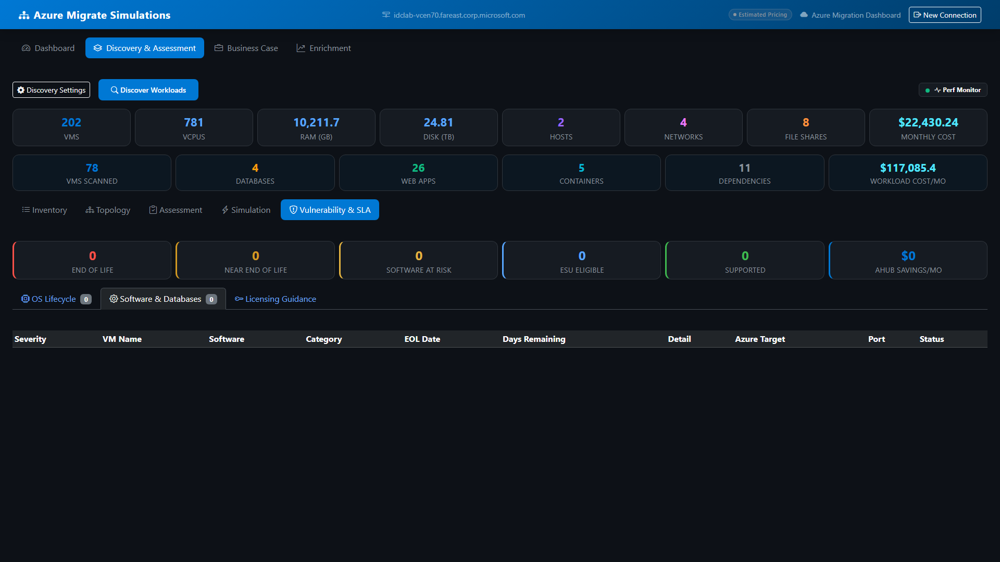
   - Identifies outdated software versions that need upgrading during migration
   - Flags unsupported database engines, runtime versions, and middleware
   - Table columns: VM Name, Software, Version, Status, End Date, Azure Alternative

3. **Licensing Guidance** — Provides Azure licensing recommendations for each workload

   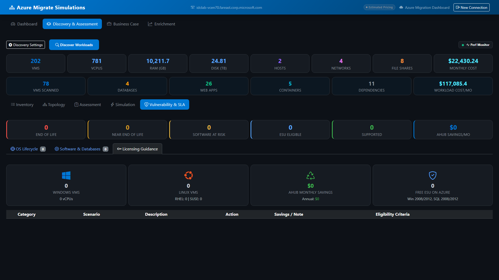
   - Azure Hybrid Benefit (AHUB) eligibility detection for Windows Server and SQL Server
   - Cost savings estimates from AHUB, Dev/Test pricing, and reserved instances
   - License mobility guidance for third-party software (Oracle, SAP, etc.)
   - Table columns: VM Name, Software, Current License, Azure Option, Savings Estimate

**How it works:**
1. After discovery data is loaded, the frontend calls the vulnerability/SLA endpoint
2. The backend evaluates each VM's OS and workload software against lifecycle databases
3. OS lifecycle data covers Windows Server (2008–2025), Red Hat Enterprise Linux, SUSE, Ubuntu, CentOS, Debian
4. Software lifecycle covers SQL Server, MySQL, PostgreSQL, Apache, IIS, .NET Framework, Java, PHP, Node.js
5. Results are categorised by risk level (Critical, Warning, Info) with actionable recommendations

---

### 4. Business Case

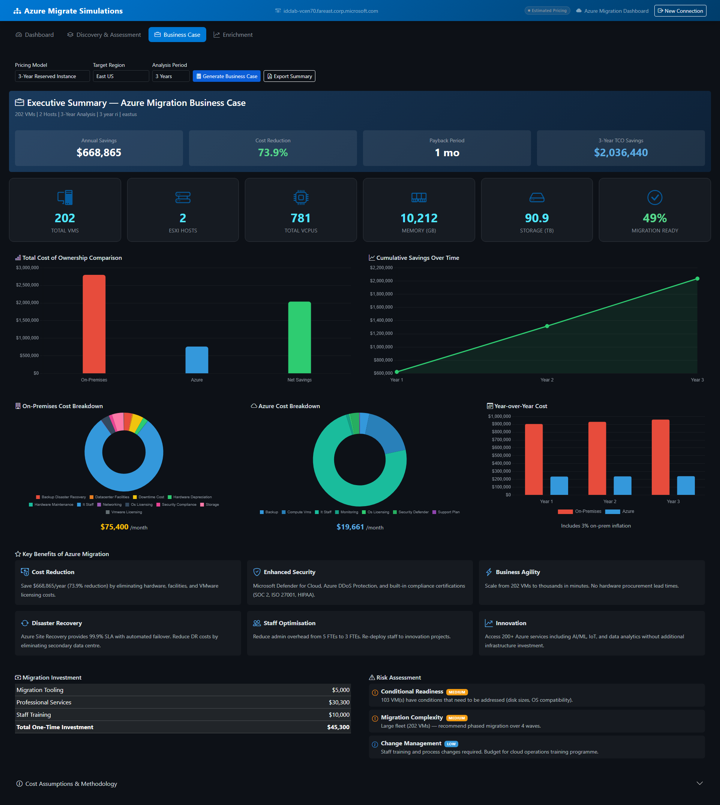

The Business Case tab generates a comprehensive on-premises TCO vs Azure cost comparison.

**Controls:**
- **Pricing Model** — Pay-As-You-Go, 1yr/3yr Reserved Instance, 1yr/3yr Savings Plan
- **Target Region** — 10 Azure regions (East US, West US 2, West Europe, etc.)
- **Analysis Period** — 1–5 year TCO horizon (default: 3 years)
- **Include PaaS** — Toggle to include workload PaaS savings in the calculation

**Report Sections:**

1. **Executive Summary** — Key metrics in large cards:
   - Total on-prem annual cost vs Azure annual cost
   - Annual savings amount and percentage
   - Payback period (months to recover migration investment)
   - 3-year total savings projection

2. **On-Prem Cost Breakdown** — Itemised monthly costs:
   - Hardware depreciation and maintenance
   - VMware vSphere licensing (per-CPU)
   - OS licensing (Windows Server, RHEL per VM)
   - Storage costs (per TB)
   - Networking infrastructure
   - Data centre facilities (power, cooling, floor space)
   - IT staff costs (based on VMs-per-admin ratio)
   - Security and compliance tooling
   - Backup and disaster recovery
   - Estimated downtime costs

3. **Azure Cost Breakdown** — Itemised monthly costs:
   - Compute (from SKU recommendations with RI/SP discounts)
   - Managed disk storage
   - Networking (bandwidth, VPN, ExpressRoute estimate)
   - Azure Monitor and diagnostics
   - Azure Backup
   - Microsoft Defender for Servers
   - Azure support plan
   - Azure Hybrid Benefit savings (for eligible Windows/SQL VMs)
   - Optional PaaS workload costs

4. **Cost Comparison Charts:**
   - Side-by-side bar chart: on-prem vs Azure monthly and annual costs
   - Doughnut chart: on-prem cost category breakdown
   - Doughnut chart: Azure cost category breakdown
   - Line chart: cumulative TCO projection over the analysis period

5. **Strategic Recommendations** — Migration strategy suggestions:
   - Migration wave recommendations
   - Reserved Instance vs Savings Plan guidance
   - Azure Hybrid Benefit utilisation opportunities
   - Right-sizing suggestions based on performance data

6. **Risk Assessment** — Key migration risks with mitigation strategies

7. **Assumptions** — Full list of cost assumptions used in the calculation (editable for what-if)

**How it works:**
1. User configures pricing model, region, and analysis period, then clicks "Generate Business Case"
2. Frontend calls `GET /api/businesscase?pricing_model=...&target_region=...&analysis_years=...`
3. Backend calculates on-prem costs using 15+ industry-standard assumptions (server hardware, VMware licensing, staffing, etc.)
4. Azure costs are calculated from SKU recommendations with region multipliers, RI/SP discounts, and add-on services
5. Migration one-time costs (tooling, training, professional services) are included in the payback calculation
6. Results include strategic recommendations and risk assessment

**API Endpoints:**
| Method | Endpoint | Description |
|---|---|---|
| `GET` | `/api/businesscase` | Generate comprehensive business case report |

---

### 5. Enrichment Data Loop

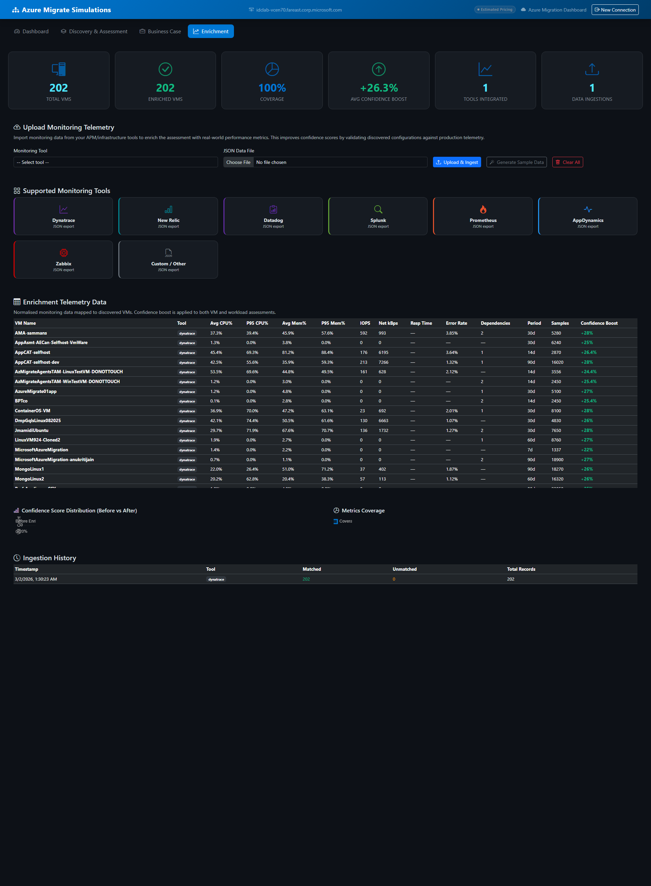

The Enrichment tab allows importing real-world monitoring telemetry to increase the accuracy and confidence of assessments.

**Status Cards (6 cards):**
- **Total VMs** — Number of VMs in the discovery dataset
- **Enriched VMs** — VMs with monitoring data matched and applied
- **Coverage** — Percentage of VMs enriched with telemetry
- **Avg Confidence Boost** — Average confidence score increase from enrichment
- **Tools Integrated** — Number of distinct monitoring tools used
- **Data Ingestions** — Total number of enrichment uploads

**Supported Monitoring Tools (8):**
| Tool | Description |
|---|---|
| Dynatrace | Full entity export with SmartScape relationships |
| New Relic | Infrastructure agent and APM data |
| Datadog | Infrastructure metrics and APM traces |
| Splunk | Infrastructure monitoring data |
| Prometheus | Time-series metrics export |
| AppDynamics | Application performance monitoring |
| Zabbix | Infrastructure monitoring |
| Custom/Other | Generic JSON format for any tool |

**Enrichment Telemetry Table:**
Shows normalised monitoring data for each enriched VM:
- Avg CPU%, P95 CPU%, Avg Memory%, P95 Memory%, IOPS, Network kBps, Response Time, Error Rate, Dependencies, Monitoring Period, Sample Count, Confidence Boost

**Confidence Impact Charts:**
- Before vs After confidence score distribution (bar chart)
- Ingestion history timeline

**How it works:**
1. User selects a monitoring tool and uploads a JSON file (or generates sample data)
2. The backend parses the file using tool-specific parsers (`enrichment.py`):
   - **Dynatrace**: Parses `entities` array with `properties` containing CPU, memory, disk, network metrics
   - **New Relic**: Parses `results` array with `host` metrics
   - **Datadog**: Parses `series` array with metric data points
   - **Prometheus**: Parses time-series metric format
   - **Generic**: Parses flat JSON with entity name and metrics
3. Each entity's display name is fuzzy-matched to discovered VM names using exact match, case-insensitive match, FQDN prefix match, and substring match
4. Matched entities produce `EnrichmentTelemetry` records with normalised metrics
5. Confidence boost is calculated using a weighted formula (max +30 points):
   - CPU metrics: +5, Memory metrics: +5, CPU P95: +3, Memory P95: +3
   - Disk IOPS: +2, Network throughput: +2, Response time: +2, Error rate: +1
   - Dependency count: +2, Monitoring period: up to +3, Sample count: up to +2
6. Boost is applied to both VM assessment and workload assessment confidence scores (capped at 98)
7. Data is persisted to `data/enrichment_data.json` and auto-loaded on restart

**Generating Sample Data:**
A generator script at `scripts/generate_dynatrace_enrichment.py` creates realistic Dynatrace Environment API v2 export data covering all discovered VMs. The generated file can be uploaded via the Enrichment tab.

**API Endpoints:**
| Method | Endpoint | Description |
|---|---|---|
| `GET` | `/api/enrichment/tools` | List supported monitoring tools |
| `POST` | `/api/enrichment/upload` | Upload monitoring JSON for enrichment |
| `POST` | `/api/enrichment/generate_sample` | Generate sample enrichment data |
| `GET` | `/api/enrichment/status` | Enrichment coverage and boost stats |
| `GET` | `/api/enrichment/data` | Get all enrichment telemetry data |
| `GET` | `/api/enrichment/vm/<name>` | Get enrichment data for a specific VM |
| `GET` | `/api/enrichment/history` | Ingestion history log |
| `POST` | `/api/enrichment/clear` | Clear all enrichment data |

---

### 6. Performance Monitoring

Background performance data collector that captures real-time metrics from the vCenter API.

**Metrics Collected (per VM, every 15 minutes):**
- **CPU Utilisation (%)** — Average and peak CPU usage
- **Memory Usage (%)** — Active memory as percentage of allocated
- **Disk IOPS** — Read and write operations per second
- **Network I/O (kBps)** — Inbound and outbound network throughput

**Performance Dashboard (in sidebar):**
- Live status indicator (green = collecting, red = stopped)
- Average CPU, memory, IOPS across the fleet
- Sample count and last collection timestamp
- Start/Stop/Collect-Now controls

**Per-VM Performance Sparklines (in What-If modal):**
- Time-series line charts for each metric
- Statistical summary: average, minimum, maximum, P95
- Helps validate right-sizing decisions with real usage data

**How it works:**
1. User clicks "Start" in the Performance Monitor section of the sidebar
2. Backend starts a background thread that queries vCenter every 15 minutes (configurable)
3. Each collection cycle pulls real-time performance counters for all powered-on VMs via pyVmomi
4. Data is stored in `data/perf_history.json` with timestamps
5. Per-VM and fleet-wide summaries are computed on demand
6. Sparkline charts in the What-If modal use this data to show trends
7. Duration can be customised via `POST /api/perf/duration`

**API Endpoints:**
| Method | Endpoint | Description |
|---|---|---|
| `GET` | `/api/perf/status` | Collector status (running, samples, interval) |
| `POST` | `/api/perf/start` | Start background collector |
| `POST` | `/api/perf/stop` | Stop collector |
| `POST` | `/api/perf/collect` | Collect a sample immediately |
| `POST` | `/api/perf/duration` | Set collection interval |
| `GET` | `/api/perf/vm/<name>` | VM time-series perf data |
| `GET` | `/api/perf/vm/<name>/summary` | VM perf stats (avg/min/max/P95) |
| `GET` | `/api/perf/workloads` | Monitored workloads with perf summaries |
| `GET` | `/api/perf/workload/<key>` | Workload time-series perf data |
| `GET` | `/api/perf/summary` | Fleet-wide perf summary |

---

### 7. CSV Export

Download assessment data as CSV files for offline analysis, reporting, or import into Excel/Power BI.

**Export Types:**
- **VM Assessment CSV** — Columns: VM Name, Recommended SKU, VM Family, Disk Type, Disk Size (GB), Monthly Cost, Readiness, Migration Approach, Confidence Score
- **Workload Assessment CSV** — Columns: VM Name, Workload Name, Type, Engine, Version, Azure Service, Migration Approach, Complexity, Monthly Cost, Confidence

**How it works:**
1. Call `GET /api/export/csv?type=vms` or `GET /api/export/csv?type=workloads`
2. Backend generates a CSV file in memory using Python's `csv.DictWriter`
3. File is returned as a downloadable attachment with appropriate MIME type

**API Endpoints:**
| Method | Endpoint | Description |
|---|---|---|
| `GET` | `/api/export/csv?type=vms` | Download VM assessment CSV |
| `GET` | `/api/export/csv?type=workloads` | Download workload assessment CSV |

---

## Architecture

```
┌─────────────────────────────────────────────────────────────────┐
│                     Flask Web Dashboard                         │
│            (src/digital_twin_migrate/web/app.py)                │
│                    57 REST endpoints                            │
│                                                                 │
│  ┌───────────┐ ┌──────────┐ ┌───────────┐ ┌─────────────────┐  │
│  │ Dashboard  │ │Discovery │ │ Business  │ │  Enrichment     │  │
│  │ Charts    │ │Assessment│ │ Case Gen  │ │  Data Loop      │  │
│  └───────────┘ └──────────┘ └───────────┘ └─────────────────┘  │
│  ┌───────────┐ ┌──────────┐ ┌───────────┐ ┌─────────────────┐  │
│  │Simulation │ │ What-If  │ │ Vuln/SLA  │ │  CSV Export     │  │
│  │Wave Plan  │ │ Modeller │ │ Lifecycle │ │                 │  │
│  └───────────┘ └──────────┘ └───────────┘ └─────────────────┘  │
├─────────────────────────────────────────────────────────────────┤
│                      Core Engine Layer                          │
│                                                                 │
│  ┌──────────────────┐  ┌────────────────────────────────────┐   │
│  │vcenter_discovery │  │        guest_discovery             │   │
│  │  (pyVmomi)       │  │  (SSH/WinRM → DBs, Web, etc.)     │   │
│  └────────┬─────────┘  └──────────────┬─────────────────────┘   │
│           │                           │                         │
│  ┌────────▼─────────┐  ┌──────────────▼─────────────────────┐   │
│  │ azure_mapping    │  │       workload_mapping             │   │
│  │ (IaaS SKU rec.)  │  │  (PaaS service rec. + playbooks)  │   │
│  └──────────────────┘  └────────────────────────────────────┘   │
│                                                                 │
│  ┌──────────────────┐  ┌──────────────────┐  ┌──────────────┐   │
│  │  enrichment.py   │  │  azure_pricing   │  │ perf_        │   │
│  │ (monitoring      │  │  (Retail API +   │  │ aggregator   │   │
│  │  data ingestion) │  │   fallback)      │  │ (collector)  │   │
│  └──────────────────┘  └──────────────────┘  └──────────────┘   │
├─────────────────────────────────────────────────────────────────┤
│  ┌──────────────────┐  ┌──────────────────┐  ┌──────────────┐   │
│  │ twin_builder     │  │azure_provisioning│  │visualization │   │
│  │ (ADT creation)   │  │ (ARM setup)      │  │ (CLI/Rich)   │   │
│  └──────────────────┘  └──────────────────┘  └──────────────┘   │
└─────────────────────────────────────────────────────────────────┘
```

---

## Tech Stack

| Category | Technology | Version |
|---|---|---|
| Language | Python | ≥ 3.10 |
| Web Framework | Flask | — |
| CSS Framework | Bootstrap | 5.3.3 (dark theme) |
| Icons | Bootstrap Icons | 1.11.3 |
| Charts | Chart.js | 4.4.1 |
| Network Graphs | vis-network | 9.1.6 |
| CLI Output | Rich | ≥ 13.0.0 |
| VMware SDK | pyVmomi | ≥ 8.0.0.1 |
| Azure SDKs | azure-digitaltwins-core, azure-identity, azure-mgmt-* | various |
| Remote Access | paramiko (SSH), pywinrm (WinRM) | runtime |
| Data Persistence | JSON files (`data/` directory) | — |

---

## Quick Start

### Prerequisites

- Python ≥ 3.10
- [uv](https://docs.astral.sh/uv/) package manager (recommended) or pip

### Install & Run

```bash
# Clone the repository
git clone <repo-url>
cd azure-migrate-simulations

# Create virtual environment and install dependencies
uv sync
# Or with pip:
python -m venv .venv
.venv/Scripts/activate    # Windows
# source .venv/bin/activate  # macOS/Linux
pip install -e .

# Launch the web dashboard
python -m digital_twin_migrate.web.app
# Open http://localhost:5000
```

### Load Sample Data

The app auto-loads sample data from the `data/` directory on startup:

```bash
# Sample files included:
# - data/vcenter_discovery.json    (202 VMs, hosts, datastores, networks)
# - data/workload_discovery.json   (35 workload recommendations across 12 VMs)
# - data/dynatrace_enrichment_export.json  (Dynatrace monitoring data for all 202 VMs)
```

To generate fresh Dynatrace enrichment data:

```bash
python scripts/generate_dynatrace_enrichment.py
# Then upload via the Enrichment tab in the dashboard
```

### Environment Variables

Create a `.env` file in the project root for live vCenter connections:

```env
VCENTER_HOST=vcenter.example.com
VCENTER_PORT=443
VCENTER_USER=administrator@vsphere.local
VCENTER_PASSWORD=your-password
VCENTER_DISABLE_SSL=true

AZURE_SUBSCRIPTION_ID=your-subscription-id
AZURE_RESOURCE_GROUP=rg-azure-migrate-simulations
AZURE_LOCATION=eastus

# Optional: API key protection for the web dashboard
MIGRATE_API_KEY=your-api-key
```

---

## CLI Usage

The project includes a CLI for automated discovery-to-digital-twin workflows:

```bash
uv run dt-migrate --help

# Discover only (no Azure Digital Twin creation)
uv run dt-migrate --discover-only --export report.json

# Full workflow: discover → map → provision → create twins
uv run dt-migrate --region eastus
```

### CLI Flags

| Flag | Description |
|---|---|
| `--discover-only` | Run vCenter discovery without creating Azure Digital Twins |
| `--skip-twin` | Skip Azure Digital Twins creation |
| `--skip-perf` | Skip performance counter collection |
| `--export <file>` | Export discovery data to JSON |
| `--region <region>` | Target Azure region (default: `eastus`) |
| `--verbose` | Enable verbose debug output |

---

## API Reference

The web dashboard exposes **57 REST API endpoints** across 9 categories:

<details>
<summary><strong>Connection & Status (5 endpoints)</strong></summary>

| Method | Endpoint | Description |
|---|---|---|
| `POST` | `/api/connect` | Connect to vCenter and start discovery |
| `GET` | `/api/discover/status` | Poll discovery progress |
| `POST` | `/api/disconnect` | Reset connection state |
| `POST` | `/api/upload` | Upload a saved discovery JSON |
| `GET` | `/api/status` | Overall app status |

</details>

<details>
<summary><strong>Infrastructure Data (6 endpoints)</strong></summary>

| Method | Endpoint | Description |
|---|---|---|
| `GET` | `/api/summary` | Dashboard summary stats and chart data |
| `GET` | `/api/topology` | Infrastructure topology graph |
| `GET` | `/api/vms` | List all discovered VMs with recommendations |
| `GET` | `/api/hosts` | List ESXi hosts |
| `GET` | `/api/fileshares` | List datastores/file shares |
| `GET` | `/api/networks` | List discovered networks |

</details>

<details>
<summary><strong>Assessment (3 endpoints)</strong></summary>

| Method | Endpoint | Description |
|---|---|---|
| `GET` | `/api/recommendations` | Azure VM SKU recommendations |
| `GET` | `/api/sku_catalog` | Available Azure VM SKU catalog |
| `GET` | `/api/export/csv` | Export assessment as CSV |

</details>

<details>
<summary><strong>VM Simulation & What-If (11 endpoints)</strong></summary>

| Method | Endpoint | Description |
|---|---|---|
| `POST` | `/api/simulate` | Run fleet-wide cost simulation |
| `POST` | `/api/simulate_vm` | Per-VM what-if scenario |
| `POST` | `/api/simulate_comparison` | Compare original vs. overrides |
| `GET` | `/api/regions` | Azure regions + cost multipliers |
| `GET` | `/api/pricing_models` | Available pricing models |
| `GET` | `/api/pricing/status` | Live pricing API status |
| `POST` | `/api/pricing/refresh` | Refresh prices from Azure Retail API |
| `GET` | `/api/whatif_overrides` | Get saved what-if overrides |
| `POST` | `/api/whatif_overrides` | Save a what-if override |
| `DELETE` | `/api/whatif_overrides/<vm>` | Delete one override |
| `DELETE` | `/api/whatif_overrides` | Clear all overrides |

</details>

<details>
<summary><strong>Workload Discovery & What-If (12 endpoints)</strong></summary>

| Method | Endpoint | Description |
|---|---|---|
| `POST` | `/api/workloads/discover` | Trigger guest-level workload discovery |
| `POST` | `/api/databases/discover` | Trigger deep database discovery |
| `GET` | `/api/workloads/status` | Poll workload discovery progress |
| `GET` | `/api/workloads/results` | Get workload recommendations |
| `GET` | `/api/workloads/topology` | Dependency topology graph |
| `POST` | `/api/workloads/whatif` | Per-workload what-if scenario |
| `POST` | `/api/workloads/simulate` | Workload fleet simulation |
| `GET` | `/api/workloads/whatif_overrides` | Get workload overrides |
| `POST` | `/api/workloads/whatif_overrides` | Save workload override |
| `DELETE` | `/api/workloads/whatif_overrides/<key>` | Delete one override |
| `DELETE` | `/api/workloads/whatif_overrides` | Clear all overrides |
| `GET` | `/api/data/files` | List saved data files |

</details>

<details>
<summary><strong>Performance Monitoring (10 endpoints)</strong></summary>

| Method | Endpoint | Description |
|---|---|---|
| `GET` | `/api/perf/status` | Collector status (running, samples, interval) |
| `POST` | `/api/perf/start` | Start background collector (15-min interval) |
| `POST` | `/api/perf/stop` | Stop collector |
| `POST` | `/api/perf/collect` | Collect a sample immediately |
| `POST` | `/api/perf/duration` | Set collection interval |
| `GET` | `/api/perf/vm/<name>` | VM time-series perf data |
| `GET` | `/api/perf/vm/<name>/summary` | VM perf stats (avg/min/max/P95) |
| `GET` | `/api/perf/workloads` | Monitored workloads with perf summaries |
| `GET` | `/api/perf/workload/<key>` | Workload time-series perf data |
| `GET` | `/api/perf/summary` | Fleet-wide perf summary |

</details>

<details>
<summary><strong>Enrichment Data Loop (8 endpoints)</strong></summary>

| Method | Endpoint | Description |
|---|---|---|
| `GET` | `/api/enrichment/tools` | List supported monitoring tools |
| `POST` | `/api/enrichment/upload` | Upload monitoring JSON for enrichment |
| `POST` | `/api/enrichment/generate_sample` | Generate sample enrichment data |
| `GET` | `/api/enrichment/status` | Coverage and confidence boost stats |
| `GET` | `/api/enrichment/data` | Get all enrichment telemetry data |
| `GET` | `/api/enrichment/vm/<name>` | Get enrichment data for one VM |
| `GET` | `/api/enrichment/history` | Ingestion history log |
| `POST` | `/api/enrichment/clear` | Clear all enrichment data |

</details>

<details>
<summary><strong>Business Case (1 endpoint)</strong></summary>

| Method | Endpoint | Description |
|---|---|---|
| `GET` | `/api/businesscase` | Generate on-prem TCO vs Azure comparison |

</details>

---

## Project Structure

```
azure-migrate-simulations/
├── pyproject.toml                          # Project config, dependencies, entry points
├── README.md
├── .gitignore
│
├── src/digital_twin_migrate/              # Main Python package (src-layout)
│   ├── __init__.py
│   ├── config.py                          # Configuration management (.env + env vars)
│   ├── models.py                          # Infrastructure data models (VMs, hosts, etc.)
│   ├── models_workload.py                 # Workload data models (databases, web apps, etc.)
│   ├── vcenter_discovery.py               # vCenter discovery engine (pyVmomi)
│   ├── guest_discovery.py                 # Guest-level discovery (SSH/WinRM → workloads)
│   ├── azure_mapping.py                   # Azure VM SKU recommendation engine
│   ├── azure_pricing.py                   # Azure Retail Prices API client + fallback
│   ├── workload_mapping.py                # Azure PaaS service mapping (24 playbooks)
│   ├── enrichment.py                      # Monitoring data ingestion & confidence boost
│   ├── azure_provisioning.py              # Azure Digital Twins provisioning (ARM)
│   ├── twin_builder.py                    # Digital twin creation
│   ├── visualization.py                   # CLI Rich console output
│   ├── main.py                            # CLI entry point
│   ├── dtdl_models.json                   # DTDL model definitions
│   └── web/                               # Flask web dashboard
│       ├── __init__.py
│       ├── app.py                         # Flask backend (57 endpoints, 3328 lines)
│       ├── validation.py                  # Request validation helpers
│       └── templates/
│           └── index.html                 # Single-page dashboard (5560 lines)
│
├── data/                                  # Runtime data (auto-loaded on startup)
│   ├── vcenter_discovery.json             # Sample vCenter data (202 VMs)
│   ├── workload_discovery.json            # Sample workload data (35 recommendations)
│   ├── dynatrace_enrichment_export.json   # Sample Dynatrace enrichment data
│   ├── perf_history.json                  # Performance collector history
│   └── whatif_overrides.json              # Saved what-if scenario overrides
│
├── scripts/                               # Utility scripts
│   ├── generate_dynatrace_enrichment.py   # Generate Dynatrace sample data
│   ├── run_discovery.py                   # Standalone vCenter discovery script
│   ├── show_summary.py                    # Print discovery summary to console
│   ├── manual_test_upload.py              # Manual HTTP upload test
│   └── manual_test_viz.py                 # Manual visualisation test
│
├── tests/                                 # Test suite (47 tests)
│   ├── conftest.py                        # Shared pytest fixtures
│   ├── test_azure_mapping.py              # Azure SKU recommendation tests
│   ├── test_config.py                     # Configuration management tests
│   ├── test_models.py                     # Data model tests
│   └── test_visualization.py              # Visualisation output tests
│
└── docs/
    └── screenshots/                       # Dashboard screenshots (add your own)
```

---

## Security

- **Credentials** — All sensitive values (vCenter password, Azure subscription ID, API key) are loaded from environment variables or `.env` file. The `.env` file is in `.gitignore` and is never committed.
- **Password masking** — `VCenterConfig.__repr__()` masks the password field with `****` in all log output.
- **API key protection** — Set `MIGRATE_API_KEY` environment variable to require an `X-API-Key` header on all `/api/*` routes. When not set, all routes are open (development mode).
- **No hardcoded secrets** — The codebase contains zero hardcoded passwords, API keys, or tokens.
- **Sample data** — All IP addresses in sample data use private-range addresses (10.x.x.x). Hostnames and URLs are synthetic placeholders.

---

## License

This project is provided as-is for demonstration and assessment purposes.
